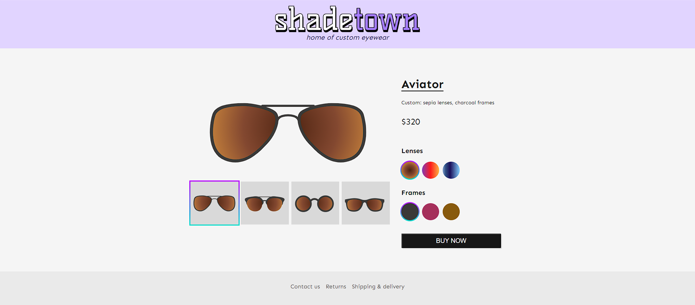

# Shadetown

Shadetown is an interactive web application for customizing sunglasses, offering a sleek, responsive design and dynamic UI.



## Features

- **Customizable Sunglasses**: Choose lens and frame colors.
- **Responsive Design**: Optimized for all devices.
- **Modern UI**: Clean, minimalistic styling.

## Technologies Used

- **HTML5**
- **CSS3**
- **JavaScript (ES6+)**

## Project Structure


Certainly! Here’s a more concise version of your README.md:

markdown
Copy code
# Shadetown

Shadetown is an interactive web application for customizing sunglasses, offering a sleek, responsive design and dynamic UI.


## Features

- **Customizable Sunglasses**: Choose lens and frame colors.
- **Responsive Design**: Optimized for all devices.
- **Modern UI**: Clean, minimalistic styling.

## Technologies Used

- **HTML5**
- **CSS3**
- **JavaScript (ES6+)**

## Project Structure

shadetown/
│
├── index.html # Main HTML file
├── src/
│ ├── assets/ # Image assets
│ ├── styles/
│ │ └── index.css # CSS for styling
│ └── main.js # JavaScript for interactivity
├── public/ # Public assets
│ └── index.html # HTML file served by Vite
├── README.md # Project documentation
└── vite.config.js # Vite configuration


## Refactoring

This project was originally built using ES5 JavaScript and has been refactored to utilize modern ES6+ features, including arrow functions, template literals, `let`/`const`, and modules.

## Setup

1. **Clone the repo:**
   ```bash
   git clone https://github.com/Adlichalbi/shadetown.git
   cd shadetown

2. **Install dependencies:**
    ```bash
    npm install

3. **Start the development server:** 
    ```bash
    npm run dev

4. **Open the project in a web browser:**
    Example : Navigate to `http://localhost:3000` to see application

## Contributing
Contributions are welcome! Please fork the repository and submit a pull request. For major changes, please open an issue first to discuss what you would like to change.

## License
Distributed under the MIT License. See LICENSE for more information.

## Contact
Adli Chalbi - adlichalbi6612@gmail.com

Project Link : https://github.com/Adlichalbi/shadetown